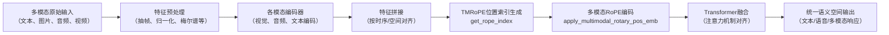

# Qwen2.5-Omni 的时间对齐与特征融合（TMRoPE）详解

---

## TMRoPE 实现流程图


---

## 一、时间对齐（TMRoPE：Time-aligned Multimodal Rotary Position Embedding）

### 核心思想
- 多模态输入（如视频帧、音频帧、图片、文本）在时间轴上需要严格对齐，才能实现跨模态的精准理解和推理。
- TMRoPE 通过为每个模态分配**三维位置编码**（时间、空间高、空间宽），使得同一时刻的视觉和听觉信息在特征空间中对齐。

### 关键实现代码

#### 1. 位置索引生成（`get_rope_index`）

文件：`low-VRAM-mode/modeling_qwen2_5_omni_low_VRAM_mode.py`

```python
def get_rope_index(
    self,
    input_ids: Optional[torch.LongTensor] = None,
    image_grid_thw: Optional[torch.LongTensor] = None,
    video_grid_thw: Optional[torch.LongTensor] = None,
    attention_mask: Optional[torch.Tensor] = None,
    use_audio_in_video: bool = False,
    audio_seqlens: Optional[torch.LongTensor] = None,
    second_per_grids: Optional[torch.Tensor] = None,
) -> Tuple[torch.Tensor, torch.Tensor]:
    """
    Calculate the 3D rope index based on image and video's temporal, height and width in LLM.
    ...
    """
    # 省略部分代码
    # 关键点：为每个模态（文本、图片、视频、音频）分配不同的三维位置索引
    # 视觉部分（视频/图片）: temporal, height, width
    # 文本部分: 1D 位置编码
    # 音频部分: temporal 维度与视频帧对齐
    # 通过 position_id_per_seconds 控制时间粒度
    # 通过 t_index, grid_hs, grid_ws 生成三维位置索引
    # 返回 position_ids, mrope_position_deltas
```

**说明：**
- 该函数会根据输入的多模态 token 序列，分别为视觉、音频、文本等模态生成对应的三维（或一维）位置编码索引。
- 对于视频和音频，时间维度的 position id 会严格按照帧率和采样率对齐，保证同一时刻的视觉帧和音频帧在 Transformer 中能被"感知"为同一时间点的信息。

#### 2. 多模态 RoPE 应用（`apply_multimodal_rotary_pos_emb`）

```python
def apply_multimodal_rotary_pos_emb(q, k, cos, sin, mrope_section, unsqueeze_dim=1):
    """
    Applies Rotary Position Embedding with Multimodal Sections to the query and key tensors.
    - 对视觉部分，分别在 temporal, height, width 三个维度上应用 RoPE
    - 对文本部分，应用标准 1D RoPE
    """
    mrope_section = mrope_section * 2
    cos = torch.cat([m[i % 3] for i, m in enumerate(cos.split(mrope_section, dim=-1))], dim=-1).unsqueeze(unsqueeze_dim)
    sin = torch.cat([m[i % 3] for i, m in enumerate(sin.split(mrope_section, dim=-1))], dim=-1).unsqueeze(unsqueeze_dim)
    q_embed = (q * cos) + (rotate_half(q) * sin)
    k_embed = (k * cos) + (rotate_half(k) * sin)
    return q_embed, k_embed
```

**说明：**
- 该函数将三维 RoPE 编码应用到注意力机制的 Query/Key 上，实现多模态 token 在时空上的对齐。
- 视觉 token 的 channel 会被分成三块，分别对应时间、高度、宽度三个维度的 RoPE。

#### 3. 注意力层集成 RoPE（`Qwen2_5OmniAttention`）

```python
def forward(
    self,
    hidden_states: torch.Tensor,
    attention_mask: Optional[torch.Tensor] = None,
    position_ids: Optional[torch.LongTensor] = None,
    ...
    position_embeddings: Optional[Tuple[torch.Tensor, torch.Tensor]] = None,
) -> Tuple[torch.Tensor, Optional[torch.Tensor], Optional[Tuple[torch.Tensor]]]:
    ...
    cos, sin = position_embeddings
    query_states, key_states = apply_multimodal_rotary_pos_emb(
        query_states, key_states, cos, sin, self.rope_scaling["mrope_section"]
    )
    ...
```

**说明：**
- 在每一层注意力机制中，都会用上述多模态 RoPE 对 Query/Key 进行旋转位置编码，确保不同模态的 token 能在时空维度上对齐。

---

## 二、特征融合

### 核心思想
- 不同模态（文本、视觉、音频）经过各自的编码器后，统一送入 Transformer 进行深度融合。
- 融合方式为**隐式对齐**：通过注意力机制，模型自动学习不同模态 token 之间的语义和时序关系。

### 关键实现代码

#### 1. 多模态特征编码

- **视觉编码器**：`Qwen2_5OmniVisionEncoder`
- **音频编码器**：`Qwen2_5OmniAudioEncoder`
- **文本编码器**：`Qwen2_5OmniThinkerTextModel`

这些编码器分别将图片/视频帧、音频帧、文本 token 编码为高维特征。

#### 2. 特征拼接与融合

在 `Qwen2_5OmniThinkerForConditionalGeneration` 的 forward 过程中：

```python
self.audio_tower = Qwen2_5OmniAudioEncoder._from_config(...)
self.visual = Qwen2_5OmniVisionEncoder._from_config(...)
self.model = Qwen2_5OmniThinkerTextModel._from_config(...)
```

- 视觉、音频、文本特征会被拼接成一个长序列，送入统一的 Transformer 进行融合。
- 通过注意力机制，模型可以自动捕捉不同模态之间的相关性，实现隐式对齐。

#### 3. 特征预处理与张量化

在数据预处理阶段（见 `video_process.md` 和 `qwen-omni-utils`）：

- 视频帧抽样、图像归一化、音频重采样、梅尔频谱提取等，保证所有模态的输入特征在时间和空间上对齐，并转换为统一的张量格式。

---

## 总结

**Qwen2.5-Omni 的时间对齐与特征融合实现要点：**
1. **TMRoPE**：为视觉、音频等模态分配三维（时间、高、宽）或一维（文本）位置编码，严格对齐时序。
2. **多模态 RoPE 应用**：在注意力机制中对 Query/Key 施加多维 RoPE，实现 token 级别的时空对齐。
3. **特征融合**：所有模态特征拼接后送入统一 Transformer，利用注意力机制实现隐式对齐和深度融合。
4. **数据预处理**：保证输入特征的时空同步和格式统一，为后续对齐和融合打下基础。

如需进一步查看某一部分的详细代码或流程图，请告知！


