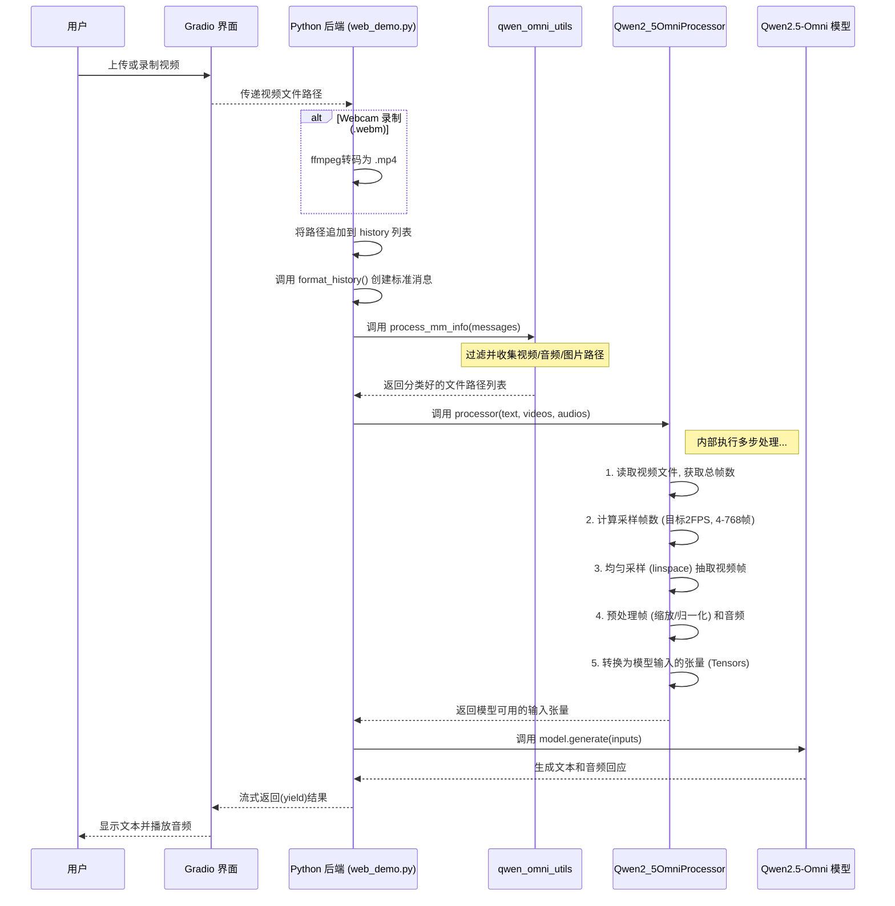

# 用户上传视频处理流程详解

下图详细描述了从用户上传视频到模型返回结果的完整处理时序。



### 第一步：用户上传视频 (Gradio 界面)

用户首先通过网页界面上的 `gr.Video` 组件提供视频。这有两种方式：

1.  **离线 (Offline) 模式**: 用户点击上传按钮，从本地选择一个视频文件。

### 第四步：特征提取 (Processor 的核心工作)

这是从"文件"到"数据"最关键的一步，原始的视频文件在这里被"翻译"成模型能够"阅读"的、结构化的数字语言（即**张量 Tensors**）。这个过程在 `predict` 函数中完成，主要分为两个阶段。

#### 阶段一：分离多媒体信息 (`process_mm_info`)

首先，代码调用了从 `qwen_omni_utils` 中导入的 `process_mm_info` 工具函数。

```python
audios, images, videos = process_mm_info(messages, use_audio_in_video=True)
```

这个函数的功能像一个过滤器和收集器。它会遍历 `format_history` 函数生成好的 `messages` 列表，并根据每个条目的 `type` 字段进行分类，将文件路径分别放入 `audios`, `images`, 和 `videos` 这三个列表中。

特别是对于视频，`use_audio_in_video=True` 这个参数指示该函数**不仅要收集视频的文件路径，还要识别出这个视频文件内部是包含音频流的**。这为后续同时处理视频的画面和声音打下了基础。

#### 阶段二：处理器进行深度转换 (`processor`)

收集到的视频路径列表被送入 `Qwen2_5OmniProcessor` 处理器的主体。这是整个流程中技术最密集的部分。

```python
inputs = processor(text=text, audio=audios, images=images, videos=videos, return_tensors="pt", ...)
```

`processor` 对象针对视频输入，在底层按顺序执行了一系列复杂的转换操作：

1.  **打开与解码**：使用 `PyAV` 或 `OpenCV` 等多媒体处理库打开视频文件，将其解码成可以逐帧访问的视频流和单独的音频流。

2.  **视觉部分 - 抽帧 (Frame Sampling)**：模型无法一次性处理视频的所有帧（计算量过大），因此需要从中选取有代表性的帧。这部分是理解模型如何"看"视频的关键，其具体策略如下：

    *   **抽取方式：均匀采样 (Uniform Sampling)**
        *   项目通过 `torch.linspace` 函数在视频的第一帧到最后一帧之间，生成 N 个等间距的采样点。
        *   然后根据这些采样点的索引，一次性、高效地从视频中将对应的帧抽取出来。
        *   这种方法保证了抽取的帧在整个视频的时长内是均匀分布的，能捕捉到从开始、到中间、再到结尾的连贯信息。

    *   **抽取数量：动态计算，目标 FPS 为 2.0**
        *   抽取的具体帧数 N 不是一个固定的数字，而是**动态计算**出来的，其目标是**将任何输入视频的帧率都统一到 2.0 FPS**。
        *   **计算公式为**：`抽取帧数 = (视频总帧数 / 视频原始帧率) * 2.0`。这本质上是用视频的总时长（秒）乘以目标采样率。
        *   **边界约束**：计算出的结果会被严格限制在 **[4, 768]** 帧的区间内。
            *   **最少 4 帧**：即使视频再短，也会至少抽取4帧来理解内容。
            *   **最多 768 帧**：即使视频再长，也只抽取768帧，以防止计算量爆炸。

    *   **举例说明**:
        *   一个 **10秒长、30FPS** 的视频，会抽取 `(300 / 30) * 2.0 = 20` 帧。
        *   一个 **1秒长、30FPS** 的视频，计算出 `2` 帧，但因为少于下限，最终会抽取 **4** 帧。
        *   一个 **20分钟长、30FPS** 的视频，计算出 `2400` 帧，但因为超过上限，最终会抽取 **768** 帧。

3.  **视觉部分 - 图像预处理 (Image Pre-processing)**：抽取的每一帧图像都会经过严格的预处理，以匹配模型训练时的数据格式：
    *   **尺寸缩放 (Resizing)**：将所有帧统一缩放到模型输入的固定尺寸（例如 `448x448` 像素），确保输入尺寸的一致性。
    *   **归一化 (Normalization)**：将图像的像素值从 `[0, 255]` 的整数范围，通过减去均值、除以标准差等方式，转换到 `[0, 1]` 或 `[-1, 1]` 之间的小数范围。这一步对于模型稳定训练和高效学习至关重要。

4.  **听觉部分 - 音频预处理 (Audio Pre-processing)**：从视频中分离出的音频流也会被处理：
    *   **重采样 (Resampling)**：将音频的采样率统一到模型要求的标准（例如 16000 Hz）。
    *   **特征转换**: 通常会将一维的音频波形数据转换成二维的**梅尔频谱图 (Mel Spectrogram)**。频谱图能更直观地展示音频在不同频率上的能量分布，是当前主流的音频识别特征。

5.  **打包成张量 (Tensor Packing)**：最后，所有处理好的视觉帧数据和音频频谱图数据，连同文本部分被转换成的 `token IDs`，被统一打包成一个或多个**张量 (Tensor)**。张量是一个多维数组，是深度学习框架（如 PyTorch）进行计算的基本单位。`return_tensors="pt"` 参数就是指定输出为 PyTorch 的张量格式。

经过这一系列步骤，一个多模态的视频文件就被彻底分解、清洗并转换成了模型可以进行数学运算的、高度结构化的数字信息。

### 第五步：模型推理 (`model.generate`) 
